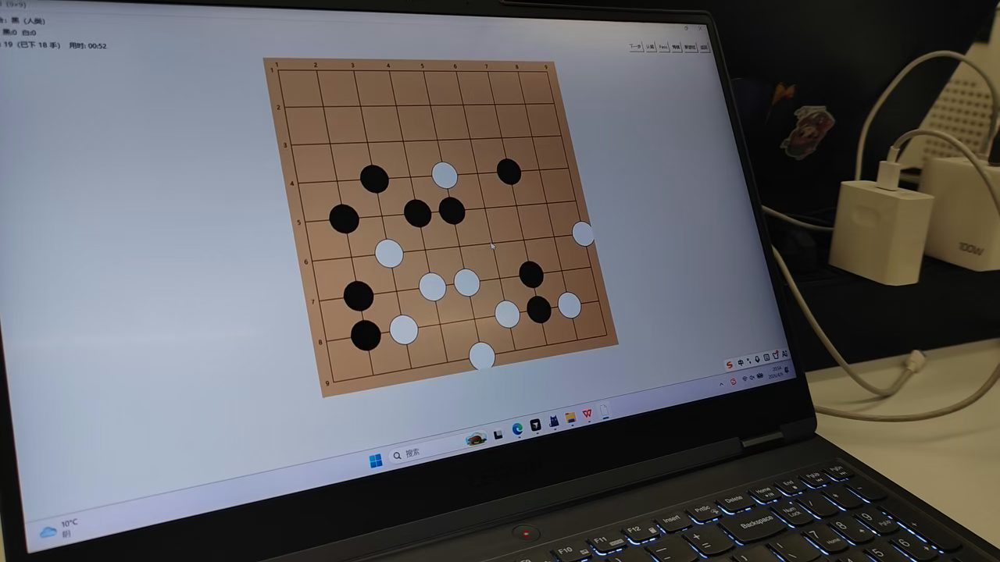

# Go AI（简易围棋引擎与对弈）

这是一个用于 **简易围棋对弈与 AI 策略实验** 的 Python 项目，包含：
- 围棋规则引擎（合法性、自杀、劫、提子、终局、计分）
- 三类智能体：`random` / `mcts` / `minimax`
- 命令行对弈脚本与批量对弈统计脚本
- Tkinter 图形化界面（人机 / AI 对弈）

> 备注：仓库中可能存在的演示视频/作业 PDF 等大文件已在 `.gitignore` 中忽略，避免 push 失败。

---

## Demo

- 点击下图观看演示视频（GitHub 附件播放器）：[`Demo`](https://github.com/user-attachments/assets/30a0eafc-3c31-41db-9616-9126bd04fcd3)

[](https://github.com/user-attachments/assets/30a0eafc-3c31-41db-9616-9126bd04fcd3)

---

## 目录结构

```
.
├── agents/                 # 智能体：random / mcts / minimax
├── dlgo/                   # 围棋规则引擎（Board/GameState/Move 等）
├── docs/                   # 文档（可选）
├── play.py                 # 命令行对弈（单局/多局）
├── bulk_play.py            # 批量对弈统计（支持多 agent 组合 + 写 txt）
├── gui.py                  # Tkinter 图形界面
└── GUI.md                  # GUI 使用说明
```

---

## 快速开始

### 1) 命令行对弈

```bash
python play.py --agent1 mcts --agent2 random --size 5
```

可选 agent：`random` / `mcts` / `minimax`

### 2) 批量对弈统计（推荐）

支持 `random / mcts_std / mcts_enh / minimax` 任意组合，结果写入 txt：

```bash
python bulk_play.py --games 100 --size 5 --black mcts_std --white random --swap --mcts_rounds 200 --mcts_time 10 --out mcts_std_vs_random.txt
```

### 3) 图形化界面（Tkinter）

```bash
python gui.py
```

更详细的 GUI 功能与操作说明见 `GUI.md`。

---

## 智能体简介

- **`random`**：从所有合法棋步中随机选择（避免无意义认输）。
- **`mcts`**：蒙特卡洛树搜索（含标准/增强两种 rollout 模式，可用于对比实验）。
- **`minimax`**：Minimax + Alpha-Beta 剪枝（含简单评估函数与置换表缓存）。

